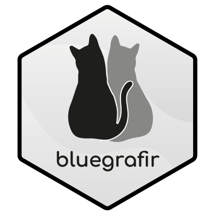

# **bluegrafir** 

  <!-- badges: start -->
  
  <!-- badges: end -->

The goal of `bluegrafir` is to handle useful psychometric tools for structural equation modelling and measurement comparison. 

**blue** and **grafi** are the main starting pieces of every function and are named after my cats. Other types of functions that require calculations do not have a specific begining. 

> _blue_ functions are used for linear tranformations. 
>
> _grafi_ functions are used for tidy tables of model fit and reliability for structural equation modelling. 

### _blue_

- **bluebase**: This function helps transform a vector into a more intrepetable value. It performs a standarization of a continous variable, therefore it has a mean 0 and standard deviation 1 (Z scores). Afterwards with another linear transformation it sets the continous variable in points of standard deviations. With a mean of 500 and a standard deviation of 100 (default).

- **bluecomp**: This function helps transform a vector into a more intrepetable value with a mean 500 and a standard deviation of 100. It uses the mean and the standard deviation of a baseline measurement you have to set. It helps compare a recent measurement against the baseline. It is commonly used to compare measurements over the years. Both vectors need to be in the same scale in order for the transformation to have a correct interpretation.

- **bluebare**: This function does percentile scaling to calculate thresholds of continous variables. It uses the cumulative frequency of the ordered raw scores and calculates standardized values (Z scores). Thresholds seperate three groups, "low", which are values with 1 standard deviation below the mean, "medium" are values with a standard deviation between -1 and 1 standard deviations and "high" which are values with 1 standard deviation over the mean.  

### _grafi_

- **grafit**: This function helps organize the  results from the lavaan package of Confirmatory factor analysis (CFA) or Structural equation models (SEM). It gives a list of 3 data frames: model fit indexes, model estimators and modification indexes. 

- **grafirel**: This function helps organize information about reliability and organize the output of the psych package of the McDonald's Omega reliability index. 

- **graficat**: This function helps organize information by setting a nice table of frequencies, proportions and cumulative frequencies from categorical variables. 

### _crel_ and _avex_

- **crel**: This function calculates Composite reliability and it is based on the formulas in Raykov, T. (2004). Behavioral scale realiability and measurement invariance evaluation using latent variable modeling. Behavior therapy, 35, 299-331.

- **avex**: This function calculates Average variance extracted (AVE) and it is also based on Raykov's paper (Raykov, T. (2004). Behavioral scale realiability and measurement invariance evaluation using latent variable modeling. Behavior therapy, 35, 299-331).

## **Installation**

`install_github("jsaraviadrago/bluegrafir")`

`library(bluegrafir)`

